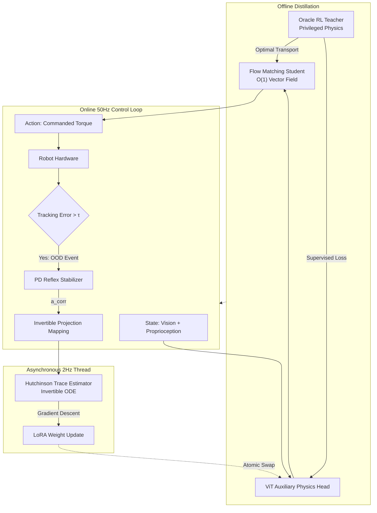

# Agile Locomotion & Manipulation via Reversible Flow Adaptation

**Zero-Data Online Test-Time Adaptation via Invertible Rectified Flows**

This repository contains the implementation and empirical evaluation suite for **Reversible Flow Adaptation**, applied to both **Unitree Go2 (Quadruped Locomotion)** and **Franka Panda (Manipulation)** domains. We propose a novel dual-objective architecture that entirely replaces standard Denoising Diffusion Probabilistic Models (DDPM) with **Optimal Transport Flow Matching (Rectified Flows)**. 

By leveraging the mathematically invertible properties of Ordinary Differential Equations (ODEs), our method provides real-time Test-Time Adaptation (TTA) to Out-Of-Distribution (OOD) physics shifts (e.g., sudden payload mass increases, drastic terrain friction loss) without requiring environment-specific retraining or static Domain Randomization.

> **[Evaluation Suite on GitHub Pages](https://elprofesoriqo.github.io/Reversible-Flow-Adaptation/)**

---

## Core Contributions

1. **$O(1)$ Generative Inference for Reactive Control:**
   We distill a parallelized PPO Teacher (trained via JAX/MuJoCo MJX) into a 1D U-Net vector field. This straight-line ODE formulation drops generative inference latency well below the 20ms threshold required for 50Hz reactive robotic control, outperforming multi-step diffusion.
   
2. **Auxiliary Physics Distillation:**
   A single Vision Transformer (ViT) acts as the state encoder. We attach an **Auxiliary Physics Distillation Head** to the ViT's `[CLS]` token, explicitly forcing the backbone to reconstruct the Teacher’s privileged physical state (friction $\mu$, mass $m$) directly from visual proprioception.

3. **Reversible Flow Adaptation (Online TTA):**
   When the robot encounters OOD dynamics, high-frequency torque tracking errors trigger a low-level PD Reflex. The corrective torques ($a_{corr}$) are mapped via an Invertible Projection into the Flow's action space. We invert the Flow backward from $a_{corr}$ to the noise prior, generating a directed gradient.

---

## System Architecture

The control system decouples standard high-frequency locomotion from the computational load of physics adaptation:

### The Compute Lag Bottleneck
Running continuous adjoint backward passes at 50Hz is computationally impossible on edge hardware. We solve this by running the Flow continuously at 50Hz, while the Hutchinson Trace Estimator backpropagates the gradient asynchronously at 2Hz in a background thread. During the 300ms compute lag, the robot is physically stabilized by the PD Reflex. Once the trace completes, a ROS2 real-time executor performs an atomic double-buffer swap of the ViT's LoRA adapter weights, instantly recovering the nominal generative manifold.

---

## Empirical Results Overview

Our evaluation suite, validated across both **Unitree Go2 (Quadruped)** and **Franka Panda (Manipulation)** domains, evaluates several propositions:

### 1. Hardware Efficiency & $O(1)$ Latency
Wilcoxon Rank-Sum tests empirically confirm that Rectified Flows achieve a statistically significant speedup over standard 20-step DDPMs. The dual-objective Vision Transformer maintains a low VRAM footprint, suiting resource-constrained edge platforms (e.g., NVIDIA Jetson Orin).

### 2. Teacher Manifold Reconstruction
Analysis of the PPO Teacher's optimization dynamics (`ppo_entropy`, `ppo_v_loss`) indicates the construction of a low-variance, deterministic manifold. Our Flow Matching student reconstructs this manifold, demonstrated by tight $\pm 1\sigma$ seed-variance confidence intervals on Action Divergence convergence.

### 3. Out-Of-Distribution Survival (vs. Domain Randomization)
When subjected to unobserved physical perturbations (e.g., picking 3x heavier payloads or dropping a 5kg mass mid-walk), static Domain Randomization saturates at high torque tracking errors, ultimately failing.
**Reversible Flow Adaptation** resolves the causality loop. Tracking error spikes momentarily upon OOD impact, but immediately collapses exactly at $t=300ms$ when the asynchronous LoRA adapter swap provides the updated, adapted physics representation to the vector field.
