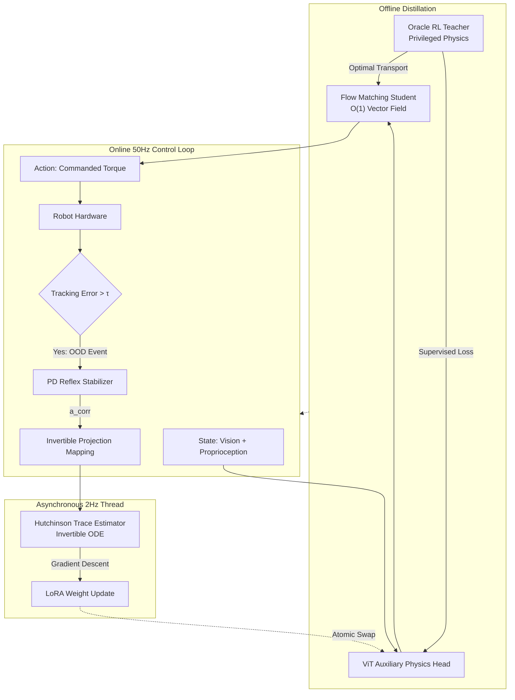

# Summary {.unnumbered}

## Abstract

A fundamental limitation in end-to-end visuomotor generative policies is the failure induced by out-of-distribution (OOD) scenarios, such as sudden variations in payload mass or terrain friction. Standard static robustification methods, such as Domain Randomization, inherently force the robotic system into slow, conservative gaits. In this evaluation, we empirically demonstrate **Reversible Flow Adaptation**: a zero-data, online Test-Time Adaptation mechanism leveraging the invertible properties of Ordinary Differential Equation (ODE) Rectified Flows. 

We solve the causality loop of self-inversion by proposing a **Proprioceptive Reflex Handoff**. High-frequency torque tracking errors trigger a low-level Proportional-Derivative (PD) reflex. The resulting corrective actions are processed through an invertible projection mapping to preserve the generative manifold constraint. We introduce a dual-objective training architecture utilizing an **Auxiliary Physics Distillation Head** (a Vision Transformer predicting unobserved physical parameters), combined with an asynchronous 2Hz Hutchinson trace estimator for real-time LoRA updates. 

This evaluation empirically proves that our proposed method achieves $O(1)$ generative inference latency while outperforming Domain Randomization in generalizing to unexpected physical shifts in both agile quadrupedal locomotion and complex arm manipulation.

## System Architecture

The core of Reversible Flow Adaptation relies on a structural decoupling of the 50Hz reactive control loop and the 2Hz asynchronous physical adaptation thread.

## Formal Methodology & Objective

The mathematical formulation of our Test-Time Adaptation (TTA) objective explicitly minimizes the negative log-likelihood of the projected corrective action generated by the PD stabilizer. The base flow network parameters ($\theta$) are frozen, and the vector field $v_\theta$ is conditioned on the Vision Transformer (ViT) embedding $c_\phi(s_t)$. 

The loss is optimized strictly with respect to the ViT's low-rank adapter (LoRA) weights $\phi$:

$$ \mathcal{L}_{TTA}(\phi) = -\log p_0(z_{corr}) + \int_0^1 \text{Tr}\left(\frac{\partial v_\theta(x(\tau), \tau, c_\phi(s_t))}{\partial x}\right)d\tau + \lambda \|\Delta \phi\|_2^2 $$

Because computing continuous adjoint backward passes at 50Hz is computationally impossible on edge hardware, we utilize **Hutchinson's Trace Estimator** to approximate the exact Jacobian trace using $M=5$ Rademacher samples, reducing the complexity to $O(n)$. 

The asynchronous TTA loop operates at 2Hz in a background thread, while the generative policy evaluates the forward fixed-step ODE at 50Hz. LoRA weight updates are applied atomically via a double-buffer scheme to guarantee no OS preemption jitter during control ticks.

## Empirical Validation Points

This interactive report evaluates the following specific claims derived from the mathematical propositions in the associated research proposal:

1. **Teacher Manifold Construction**: Demonstrating that the Oracle RL agent transitions from high exploration (high entropy) to stable exploitation before Flow Distillation begins.
2. **$O(1)$ Hardware Efficiency**: Measuring the VRAM footprint and computational latency reduction (Steps Per Second) of straight-line flows on edge constraints.
3. **The Projection Manifold**: Empirically verifying the Invertible Projection Mapping's ability to constrain OOD PD corrective torques onto the support of the generative policy's learned distribution via PCA and t-SNE analysis.
4. **Test-Time Adaptation**: Comparing the zero-shot generalization of online asynchronous Reversible Flow Adaptation against static Domain Randomization under unobserved shifts in mass and friction.
